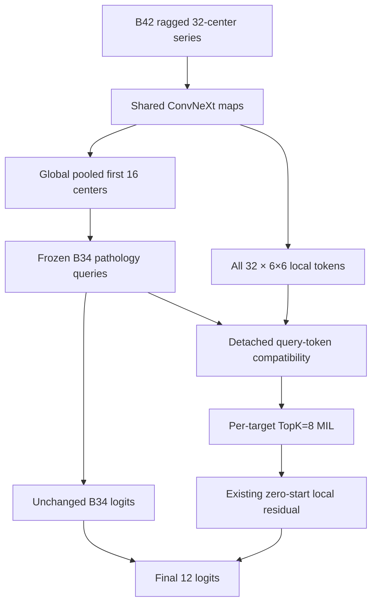

# B48 — Global-query-conditioned cross-series sparse MIL

## Status

**PREPARED / NOT RUN.**

B48 is frozen before any B48 preflight, optimizer step, scanner-domain score, or
Expert-58 diagnostic is inspected. It was prepared in a separate branch while
the five B46 folds are running. It must not be merged into the checkout running
B46 until all five B46 checkpoints exist, because B46's runner pins its fold
manifest but does not pin a source revision.

B48 is deliberately **not** a B46 continuation. It starts every arm from the
same full-fill Phase-9/B34 base checkpoint used by B42; it never loads a B46
fold checkpoint, B46 OOF prediction, B46 gold label, or gold-cell weight.
That isolates the image representation question from B46's supervision question.

The historical B47 native-grid experiment remains separate and unrun. B48 does
not use B47's 240-cell grid, continuous region encoding, FP32 top-k change, or
any slice Transformer. Combining either B47 capability with B48 would be a new
factorial experiment, not an interpretation of B48.

## Question

> Can the global branch's pathology-specific, cross-series feature state help
> the sparse spatial branch rank local evidence, beyond a matched static-query
> local head?

B42 already computes the needed representations from the same ConvNeXt feature
map but does not connect them until the final scalar residual addition.



The global representation is the **post-cross-attention pathology query**
`[B, 12, 768]`, not a final probability. It has already attended over the
study's available series and therefore retains target-specific feature context.
The local branch continues to score every valid spatial token; B48 never says
"global ACL probability is low, so do not look locally for ACL." Such a hard
gate would compound false negatives.

## Frozen representation

For target (t), local B42 token (x_i), and global B34 query (q_t), B42's
unchanged token score is:

\[
e_{t,i}=w_t^\top x_i+b_t.
\]

B48 adds one bounded low-rank cosine compatibility residual:

\[
s_{t,i}=e_{t,i}+	anh(a_t)\,
\cos\left(W_q\operatorname{LN}(q_t),\,W_k\operatorname{LN}(x_i)\right),
\]

where (W_q,W_k:768\rightarrow96), 96 is one frozen B34 attention-head width,
and (a_t) is one new target-wise gate. `a_t` starts at exactly zero. Thus at
step zero B48 reproduces B42's local score, top-k locations, local logit, and
final logit exactly.

The query is detached before entering (W_q). The local auxiliary BCE can train
the B48 gate and projections, but it cannot create a new gradient route through
B34's frozen context Transformer, cross-attention, or pathology classifier.

The existing sparse pooling and residual stay unchanged:

\[
z_t^{local}=\operatorname{LME}(\operatorname{TopK}_8(s_{t,*})),\qquad
z_t=z_t^{B34}+\tanh(g_t)z_t^{local}.
\]

`g_t` is B42's existing zero-start sparse residual gate. The direct local BCE
already present in B42 gives the new context gate an immediate gradient, even
while (g_t=0).

## Matched arms

| Arm | Query supplied to local scorer | What it controls/tests |
|---|---|---|
| `static_prior_control` | frozen pathology query after `pathology_context` and query normalization, before image-memory cross-attention | added compatibility-head capacity without patient-specific global context |
| `post_cross_attention_candidate` | frozen pathology query after cross-attention over this study's B34 series memory | actual study-dependent global-to-spatial conditioning |

Both arms have the same B42 initialization, B48 parameter count, rank, loss,
optimizer, seed, train UID list, image preprocessing, TTA, and fixed endpoint.
The only arm-dependent value is which already-frozen query is read. The primary
causal estimate is candidate minus control, not candidate minus an unrelated
historical model.

## Frozen parent/training contract

B48 retains B42 exactly:

```text
native-volume percentile normalization
90% native center crop
constant-area native-aspect resize, reference area 448²
reflection padding only to stride 32
ragged per-series encoding
32 deterministic 2.5D centers, gap=1
6×6 local grid, top-k=8, temperature=1.0
local auxiliary weight=1.0
final ConvNeXt stage/output norm trainable
B34 non-encoder hierarchy frozen and eval-mode
head LR=1e-4; encoder-tail LR=5e-6
weight decay=1e-4; gradient clip=1.0
effective studies/update=2; exactly two epochs
no checkpoint selection; TTA [-1,0,+1]
```

The B48 supervision contract is intentionally different from B46 only where a
proper non-gold architecture gate requires it:

```text
source                     4,349 report-only weak studies only
official gold gradients    0
B46 fold labels/weights    prohibited
training rows              frozen scanner-domain split = "train"
validation rows            seen-scanner and unseen-scanner rows, no gradients
target balancing           recomputed from B48 train rows only
```

The domain split excludes all 58 official gold studies. It is a scanner proxy,
not a true hospital/site split, and the labels remain report-derived. It can
test whether a mechanism travels to unfamiliar acquisition profiles; it cannot
establish clinical correctness or authorise a competition submission.

## Required preflight

The runner performs both arms' preflights before either optimizer starts. Each
preflight requires:

- B42 synthetic rectangular shapes: `448×448`, `320×640`, `640×320`, `256×800`;
- one real rectangular DICOM study and B42's real worst-case sequential batch;
- finite global, local, and final logits;
- nonzero encoder-tail, evidence-head, sparse-gate, and B48 context-gate gradients;
- zero gradient on every frozen B34 non-encoder parameter;
- a detached context query;
- post-attention query reconstruction of the real B42 global logits, with
  maximum absolute error no greater than `1e-6`;
- zero projection gradient while the new context gate is exactly zero, then
  nonzero `Wq` and `Wk` gradients after a temporary nonzero-gate probe;
- no optimizer step and restoration of the zero-start gate afterward.

Unit tests also require exact B42 local equivalence at a zero context gate,
post-attention query reconstruction of unchanged B42 base logits, absent-series
masking before top-k, and a runner refusal if B46 or the domain split is
incomplete.

Every completed arm checkpoint records an identical matched-pair identity:
the replication seed, frozen config, base checkpoint, train UID set,
train-only target-balance multipliers, domain JSON/CSV digests, fill-only label
artifact digests, series-policy signature, and B48 model/training source
digests. The evaluator refuses a pair if any of those values differs. It also
rechecks the current `train.csv`, the three fill-only label files, and the B48
model source before scoring, and derives loader/bootstrap provenance from the
checkpoint pair seed rather than the YAML default.

## Primary endpoint and frozen verdict

The primary surface is `holdout_unseen_scanners`; the `validation_seen_scanners`
surface is a comparator. All metrics use the domain split's predeclared
`comparable_targets` and ignore zero-weight weak cells. Weak-label ROC-AUC
converts the stored soft training targets to binary report states at the frozen
`0.5` boundary; weighted BCE remains on the original soft targets.

\[
\Delta_{unseen}=\operatorname{macroAUC}_{candidate}-
\operatorname{macroAUC}_{control}.
\]

Report both surfaces, paired 5,000-study bootstrap, weighted BCE, per-target
AUCs, leave-one-target-out deltas, and each arm's domain gap:

\[
gap=\operatorname{AUC}_{seen}-\operatorname{AUC}_{unseen}.
\]

Also record learned context gates, mean absolute context-score contribution,
and the fraction of top-k locations changed from the inherited static score.

**Support** requires every condition below:

```text
all 12 targets are comparable on the frozen domain surface
Delta_unseen >= +0.010
paired 95% CI lower bound > 0
P(candidate > control) >= 0.95
at least 7 of 12 target AUCs improve
every leave-one-target-out delta remains > 0
Delta_seen >= -0.005
candidate domain-gap increase <= +0.005
```

**No support** if `Delta_unseen < +0.005` or the paired lower CI is `<= 0`.
Otherwise, including a surface with fewer than twelve comparable targets, the
result is **inconclusive**. No outcome authorises a parameter sweep, a B47+B48
combination, an Expert-58-driven revision, or a hidden submission.

The predeclared seed pairs are `2026`, `2037`, and `2048`. Seed `2026` is the
compute gate; if it supports the mechanism, the other two pairs must be run and
reported without selecting a best seed. A three-seed promotion claim requires
all three unseen deltas positive, mean unseen delta at least `+0.010`, and a
three-seed nested paired-bootstrap lower bound above zero.

## Post-B46 launch sequence

Do not do steps 1–2 while B46 is reading the same DICOM disk. After all five
B46 checkpoints exist:

```bash
cd /media/talafha/Disk_1/CNN_CPC
conda activate rsna-knee
git pull --ff-only origin main
export PYTHONPATH="$PWD/developments/src:${PYTHONPATH:-}"

# Only if the header artifact is not already present.
python -m rsna_knee.dataset_header_audit \
  --data-root "$DATA_ROOT" \
  --out-root runs/dataset_header_audit

python -m rsna_knee.domain_shift_split \
  --data-root "$DATA_ROOT" \
  --header-csv runs/dataset_header_audit/header_by_series.csv \
  --labels-root "$LABELS_ROOT" \
  --out-root runs/domain_shift_split
```

Run the first matched pair; the script verifies the domain-split SHA and every
B46 fold checkpoint, executes both preflights, never overwrites a checkpoint,
and writes separate arm roots:

```bash
export B46_ROOT="/path/to/runs/079_Experiment_B46_gold_anchored_crossfit/b46_gold_anchored_crossfit"
export DOMAIN_SPLIT_ROOT="$PWD/runs/domain_shift_split"
export B48_ROOT="$PWD/runs/081_Experiment_B48_global_conditioned_spatial_mil/b48_global_conditioned_spatial_mil"
export DATA_ROOT="/media/talafha/Disk_1/CNN_CPC/rsna-knee-abnormality-detection"
export LABELS_ROOT="/path/to/fill_merged_export"
export SERIES_POLICY="/path/to/frozen_series_policy.json"
export BASE_CHECKPOINT="/path/to/full_fill_b34.pt"

B48_SEED=2026 bash developments/scripts/run_b48_domain_pair.sh
```

After both checkpoints exist, score exactly the matched pair:

```bash
python -m rsna_knee.b48_global_conditioned_sparse_eval \
  --config config/b48_global_conditioned_sparse.yaml \
  --data-root "$DATA_ROOT" \
  --labels-root "$LABELS_ROOT" \
  --base-checkpoint "$BASE_CHECKPOINT" \
  --domain-split "$DOMAIN_SPLIT_ROOT/domain_split.json" \
  --control-checkpoint "$B48_ROOT/seed_2026/static_prior_control/b48_static_prior_control_model.pt" \
  --candidate-checkpoint "$B48_ROOT/seed_2026/post_cross_attention_candidate/b48_post_cross_attention_candidate_model.pt" \
  --out-root "$B48_ROOT/seed_2026/evaluation"
```

## Implementation

```text
config/b48_global_conditioned_sparse.yaml
developments/src/rsna_knee/b48_global_conditioned_sparse_mil.py
developments/src/rsna_knee/b48_global_conditioned_sparse_training.py
developments/src/rsna_knee/b48_global_conditioned_sparse_eval.py
developments/scripts/run_b48_domain_pair.sh
developments/tests/test_b48_global_conditioned_sparse_mil.py
developments/tests/test_b48_runner_resume.py
```

No `b36_*`, `b42_*`, `b46_*`, B46 config, B46 fold manifest, or B47 module is
modified by B48.
