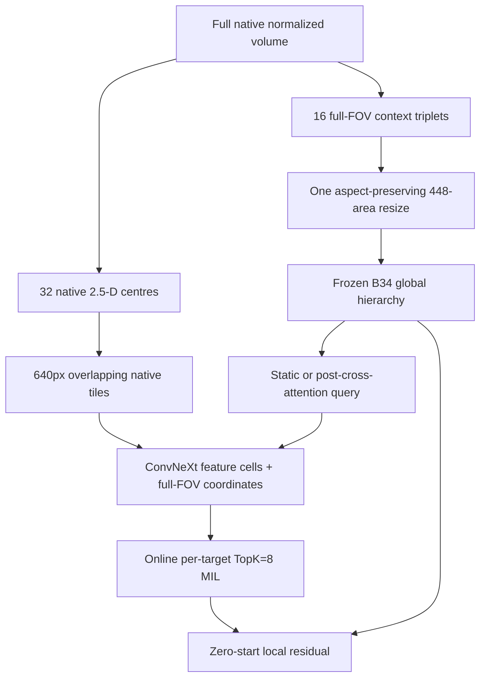

# B49 — Full-FOV native tiled multi-resolution global-conditioned sparse MIL

## Status

**COMPLETED / EXPLORATORY CANDIDATE-ONLY KAGGLE PATH AVAILABLE.**

For seed 2026, the candidate-minus-control unseen macro-AUC difference was
`+0.00055`, below B49's predeclared `+0.010` support threshold. The Kaggle
candidate route is therefore exploratory only and does not promote the new
global-conditioning mechanism.

B49 is a separate post-B48 experiment. It does not modify B48, reuse a B48
checkpoint, use a B46 fold checkpoint, use B47 output, or use official gold
labels/weights. B49's only inherited run-time artefact is B48's already-frozen
report-only scanner-domain split. B48 completion is a sequencing guard, not an
input to the B49 model.

## Question

> Does a local sparse-MIL branch retain more useful evidence when it sees the
> complete native in-plane field of view in overlapping tiles, while a separate
> low-resolution branch provides the B34 global pathology context?

Earlier B42/B48 local preprocessing removes the outer 5% from each edge and
resizes the retained 90%×90% field to about 448² pixels. That is valid for the
matched B48 comparison, but it cannot preserve all native in-plane detail. The
native-geometry audit showed common 512², 640², 1024² and rectangular matrices,
so a <=640 canvas cannot retain the selected FOV for nearly all series without
resampling. B49 changes representation prospectively; it is not an adjustment
to B48 while it is running.



The downsampled branch is explicitly **global context only**. No local evidence
tile passes through `interpolate`, a fixed-canvas resize, or the historical 90%
centre crop.

## Frozen image contract

| Branch | Slice centres | In-plane field | Resize | Purpose |
|---|---:|---|---|---|
| Global context | 16 historical B34 centres | 100% native FOV | One aspect-preserving constant-area resize near 448² | Reproduce frozen B34 base logits and pathology query |
| Local sparse evidence | 32 deterministic B35 centres | 100% native FOV | **None** | Score native ConvNeXt cells with sparse MIL |

Both branches apply the same deterministic normalization first: DICOM pixels
are decoded, RescaleSlope/Intercept is applied, MONOCHROME1 is inverted where
needed, and the full native volume is clipped at p1/p99 and mapped to [0,1].
This intensity mapping does not discard a location or change in-plane sampling.

### Local tile geometry

```text
tile size                   640 x 640 native pixels
adjacent overlap            128 pixels
maximum origin stride       512 pixels
tile padding                reflection outside the native FOV only
local full-image resize     prohibited
local centre crop           prohibited
tile encoder chunk          2 triplets at a time
```

The origin grid covers the complete source. When the final step would be small,
origins are spread evenly rather than producing a tiny last stride.

| Native matrix | B49 local tiles | What happens |
|---|---:|---|
| 512×512 | 1 | 512 native pixels retained; 64 pixels of reflection padding on each side |
| 640×640 | 1 | One unmodified native tile |
| 1024×1024 | 4 | Two tile origins per axis: 0 and 384 |
| 640×1280 | 3 | One vertical tile; horizontal origins 0, 320, 640 |

Tile overlap supplies encoder receptive-field context, not duplicate evidence.
For adjacent tile origins `a` and `b`, B49 assigns the overlap at the midpoint
of `[b, a + 640]`: cells before that midpoint belong to the first tile and cells
from it belong to the next. The required preflight and unit tests verify every
native pixel centre has exactly one owner; the runtime layout constructor also
checks that its one-dimensional ownership partitions have no gap or overlap.
Padding cells and non-owned overlap cells are masked before TopK selection.

B49 preserves source pixels passed to local ConvNeXt tiles, but it does not
pretend native matrices or physical FOVs are equal. The audited 0.1667–0.5625
mm/pixel spacing range remains a separate physical-scale question; B49 does not
add resampling while testing this no-resize representation change.

## Model

The global hierarchy is B34's frozen, evaluation-mode pathway. B49 rebuilds its
pathology state from 16 full-FOV context vectors, then reads either:

| Arm | Local query | Tests |
|---|---|---|
| `static_prior_control` | pathology query after pathology context but before study-memory cross-attention | capacity of the new query-compatible native tile head |
| `post_cross_attention_candidate` | pathology query after cross-attention over current-study series | study-dependent global-to-local conditioning |

For native local feature token `x_i`, full-FOV coordinate `c_i`, and query
`q_t`, B49 uses:

\[
u_i=\operatorname{LN}(x_i)+P_z(z_i)+P_c(\phi(c_i))+m_{series(i)},
\]

\[
s_{t,i}=w_t^\top u_i+b_t+\tanh(a_t)\cos(W_q\operatorname{LN}(q_t),W_k\operatorname{LN}(u_i)).
\]

`P_c` is a zero-initialised projection of a continuous 12-value coordinate
basis: normalized row/column, square, and two sine/cosine frequencies. It
replaces a fixed position lookup because native tile grids vary by matrix shape.
The query is detached before `Wq`; B49 cannot create a second gradient route
into B34's frozen cross-attention hierarchy.

Each pathology keeps the strongest eight valid scores with an online merge of
tile-chunk top values. That is exactly global TopK over all tiles, but retains
only `12 × 8` scores/identities rather than every tile feature map. The local
evidence scores and TopK selection are float32: B49 can have thousands of
near-tied native cells, so bfloat16 rounding must not choose which cells enter
the sparse pool. The local prediction and final residual remain:

\[
z_t^{local}=\operatorname{LME}(\operatorname{TopK}_8(s_{t,*})),\qquad
z_t=z_t^{B34}+\tanh(g_t)z_t^{local}.
\]

Both `g_t` and `a_t` start at zero. The direct local BCE trains both local
mechanisms while the final residual is initially closed.

## Frozen supervision and endpoint

```text
source                         same 4,349 report-only weak studies as B48
official gold gradients        0
B46/B48 checkpoint weights     prohibited
domain train rows               frozen split = train
validation rows                 frozen seen and unseen scanner holdouts
target balance                  recomputed from B49 train rows only
effective studies/update        2, encoded sequentially
epochs                          exactly 2, no checkpoint selection
TTA                             [-1, 0, +1] only at evaluation
```

The primary causal comparison is B49 candidate minus B49 static control on the
unseen-scanner surface. A later B49-static versus B48-static contrast is only a
descriptive representation diagnostic; it is not the B49 matched mechanism
endpoint and must not tune tile geometry.

The frozen support/no-support rule is identical to B48, except that the claim
is limited to global conditioning within B49's native-tile representation:

```text
Support: all 12 targets comparable; unseen Delta >= +0.010; paired 95% CI
lower bound > 0; P(candidate > control) >= 0.95; >=7/12 targets improve; every
leave-one-target-out Delta > 0; seen Delta >= -0.005; gap increase <= +0.005.

No support: unseen Delta < +0.005 OR paired lower CI <= 0.
Otherwise: inconclusive.
```

## Required preflight

Before either arm takes an optimizer step, the launcher runs both arms through:

1. Exact ownership checks on 320×300, 512², 640², 1024² and 640×1280 geometry.
2. A real high-tile-count DICOM source through full tiled forward/backward.
3. Full-FOV B34 post-attention query reconstruction, max error <= 1e-6.
4. Finite global/local/final logits and non-zero encoder-tail, evidence,
   sparse-gate, coordinate-projection, and context-gate gradients.
5. Zero `Wq/Wk` gradients while the context gate is zero, then non-zero
   `Wq/Wk` gradients after a temporary open-gate probe.
6. Proof that no frozen non-encoder B34 parameter receives a gradient.

It makes no optimizer step and no checkpoint. It reports native tile count,
valid token count, and peak memory, so do not bypass it if it runs longer than
B48's preflight.

## Post-B48 launch

Use a separate worktree/branch after the B48 seed pair completes. Keep the
existing `DOMAIN_SPLIT_ROOT`; do **not** recreate the split.

```bash
cd /media/talafha/Disk_1/CNN_CPC_b49_run
conda activate rsna-knee
export PYTHONPATH="$PWD/developments/src:${PYTHONPATH:-}"

export DATA_ROOT="/media/talafha/Disk_1/CNN_CPC/rsna-knee-abnormality-detection"
export LABELS_ROOT="/path/to/fill_merged_export"
export SERIES_POLICY="/path/to/frozen_series_policy.json"
export BASE_CHECKPOINT="/path/to/full_fill_b34.pt"
export DOMAIN_SPLIT_ROOT="/media/talafha/Disk_1/CNN_CPC_b48_run/runs/domain_shift_split"
export B48_ROOT="/media/talafha/Disk_1/CNN_CPC_b48_run/runs/081_Experiment_B48_global_conditioned_spatial_mil/b48_global_conditioned_spatial_mil"
export B49_ROOT="$PWD/runs/082_Experiment_B49_native_tiled_multiscale_mil/b49_native_tiled_multiscale_mil"

B49_SEED=2026 bash developments/scripts/run_b49_native_tiled_domain_pair.sh
```

The script verifies B48 seed 2026 completion and the exact domain-split SHA,
runs both B49 preflights, then runs each fixed-E2 arm without overwrite.

After both checkpoints exist, run exactly one paired evaluator:

```bash
PAIR="$B49_ROOT/seed_2026"
python -m rsna_knee.b49_native_tiled_multiscale_eval \
  --config config/b49_native_tiled_multiscale.yaml \
  --data-root "$DATA_ROOT" \
  --labels-root "$LABELS_ROOT" \
  --base-checkpoint "$BASE_CHECKPOINT" \
  --domain-split "$DOMAIN_SPLIT_ROOT/domain_split.json" \
  --control-checkpoint "$PAIR/static_prior_control/b49_static_prior_control_model.pt" \
  --candidate-checkpoint "$PAIR/post_cross_attention_candidate/b49_post_cross_attention_candidate_model.pt" \
  --out-root "$PAIR/domain_evaluation" \
  --n-bootstrap 5000
```

The evaluator refuses an unmatched pair, changed source/config fingerprints,
changed base checkpoint, changed label artefacts, changed domain split, or a
checkpoint that used gold labels.

## Candidate-only exploratory Kaggle inference

After the fixed matched evaluation is complete, the post-cross-attention
candidate can be materialised as one **exploratory** Kaggle submission.  This
does not promote B49, alter the fixed experiment, or permit a post-hoc blend.
It uses raw sigmoid probabilities, the frozen `[-1, 0, +1]` TTA, and no
thresholding or calibration.

Use the hidden-safe dual-T4 route in
[`B49_KAGGLE_DUALGPU_HIDDEN_SAFE_SUBMISSION.md`](B49_KAGGLE_DUALGPU_HIDDEN_SAFE_SUBMISSION.md).
Kaggle Code Competition reruns a committed notebook that writes
`/kaggle/working/submission.csv`; it does not accept a locally uploaded CSV as
a hidden-test submission. The notebook route verifies candidate provenance,
splits complete studies across two T4s, materializes one TTA context view at a
time, and preserves the fixed candidate predictions.
